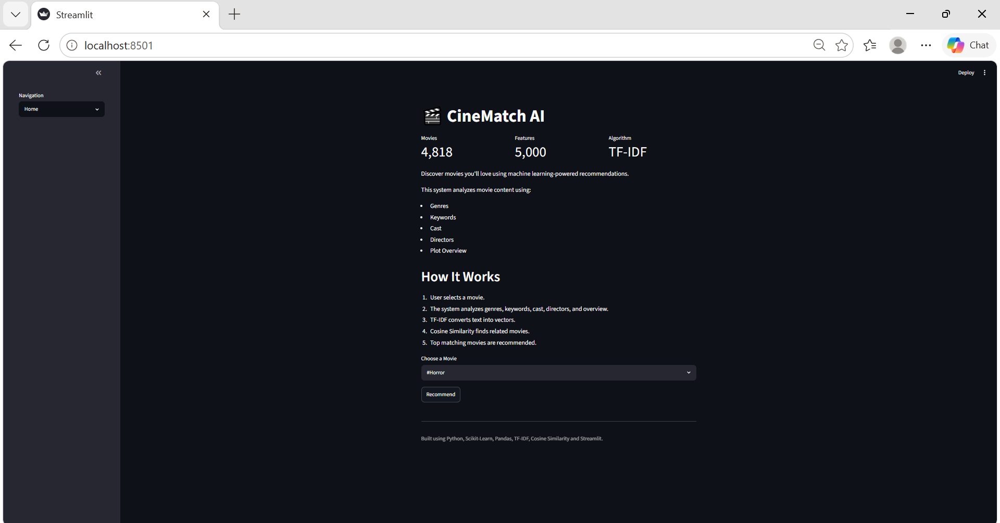
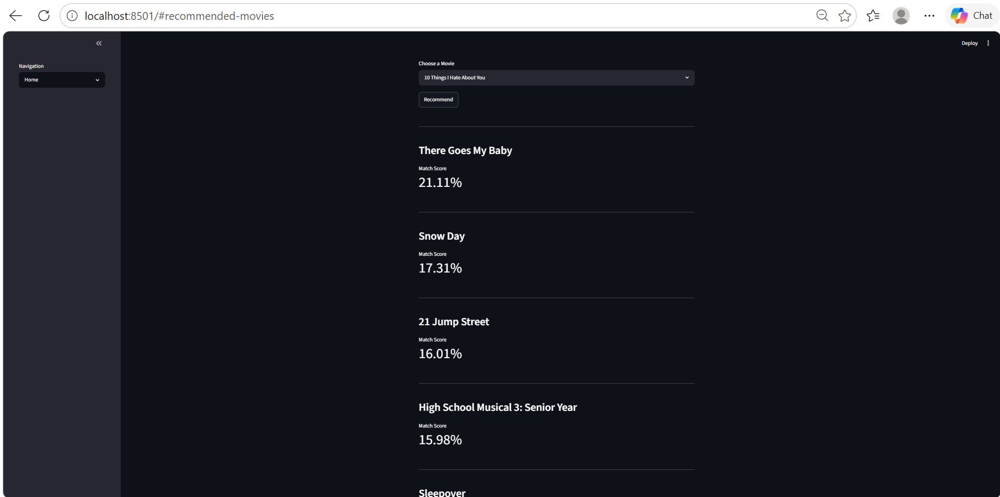
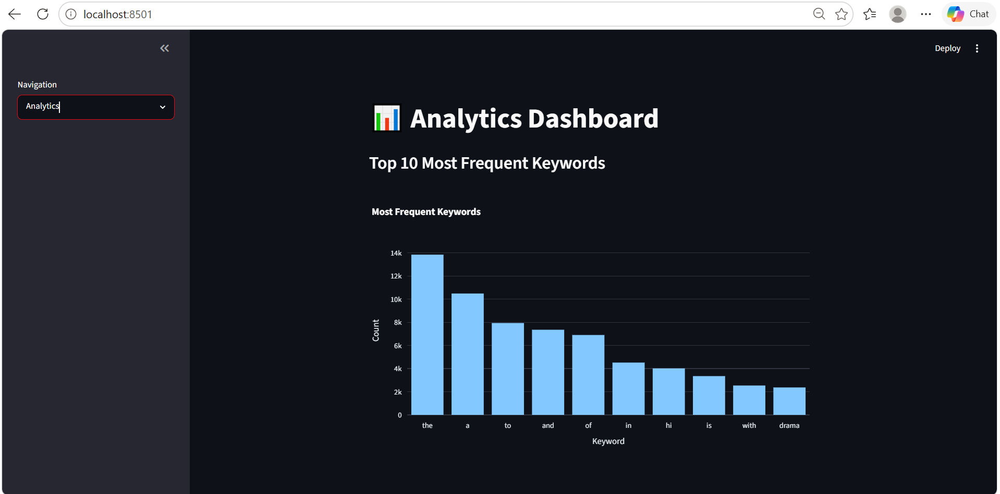
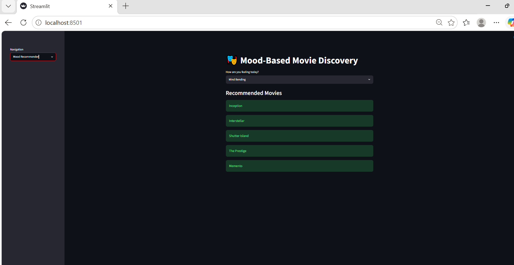
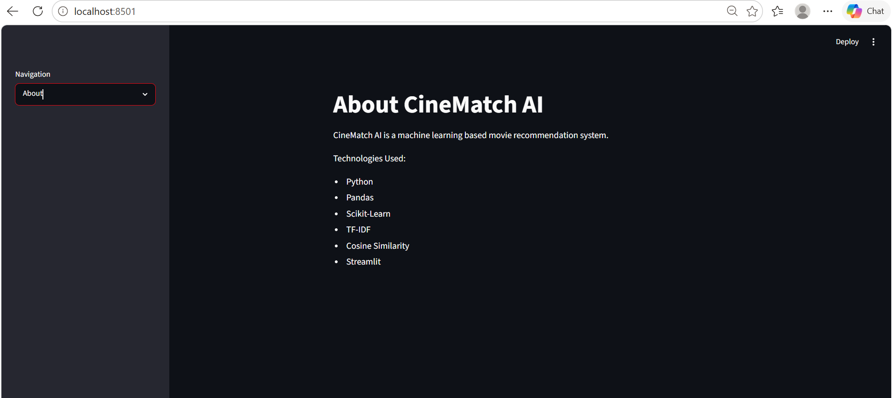

#  CineMatch AI

A Machine Learning-powered Movie Recommendation System that helps users discover movies based on content similarity and mood preferences.

---

##  Live Features

1. Content-Based Movie Recommendations

2. TF-IDF Vectorization

3. Cosine Similarity Matching

4. Match Score Calculation

5. Analytics Dashboard

6. Mood-Based Movie Discovery

7. Interactive Streamlit Interface

8. Dark Themed UI

---

##  Problem Statement

With thousands of movies available across streaming platforms, users often struggle to discover content that matches their interests.

CineMatch AI solves this problem by leveraging Machine Learning and Natural Language Processing techniques to analyze movie metadata and recommend similar movies intelligently.

---

##  Machine Learning Pipeline

```text
Dataset
   ↓
Data Cleaning
   ↓
Feature Engineering
   ↓
Text Vectorization (TF-IDF)
   ↓
Cosine Similarity
   ↓
Recommendation Engine
   ↓
Streamlit Web Application
```

### Recommendation Factors

* Genres
* Keywords
* Cast
* Directors
* Movie Overview

---

##  Tech Stack

### Machine Learning

* Python
* Pandas
* NumPy
* Scikit-Learn
* NLTK

### Frontend

* Streamlit

### Visualization

* Plotly

---

##  Dataset

TMDB 5000 Movies Dataset

Files Used:

* tmdb_5000_movies.csv
* tmdb_5000_credits.csv

Total Movies Analyzed:

```text
4,818
```

---

##  Application Screenshots

###  Home Page



---

###  Movie Recommendations



---

###  Analytics Dashboard



---

###  Mood-Based Recommender



---

###  About Page



---

## ⚙️ Installation

Clone the repository:

```bash
git clone https://github.com/ManasviReddy06/CineMatch-AI.git
```

Move into the project directory:

```bash
cd CineMatch-AI
```

Install dependencies:

```bash
pip install -r requirements.txt
```

Run the application:

```bash
streamlit run app.py
```

---

##  Project Structure

```text
CineMatch-AI
│
├── assets/
│   ├── homepage.png
│   ├── recommendations.png
│   ├── analytics.png
│   ├── mood.png
│   └── about.png
│
├── models/
│   └── movies.pkl
│
├── notebooks/
│   └── movie_recommender.ipynb
│
├── src/
│   └── preprocess.py
│
├── .streamlit/
│   └── config.toml
│
├── app.py
├── requirements.txt
├── README.md
└── .gitignore
```

---

##  Future Improvements

* Collaborative Filtering
* Hybrid Recommendation System
* User Authentication
* Personalized Watchlists
* Real-Time TMDB API Integration
* Trailer Recommendations
* Genre-Based Filtering

---

##  Author

**Manasvi Reddy**

Machine Learning Assignment Submission – Round 2
